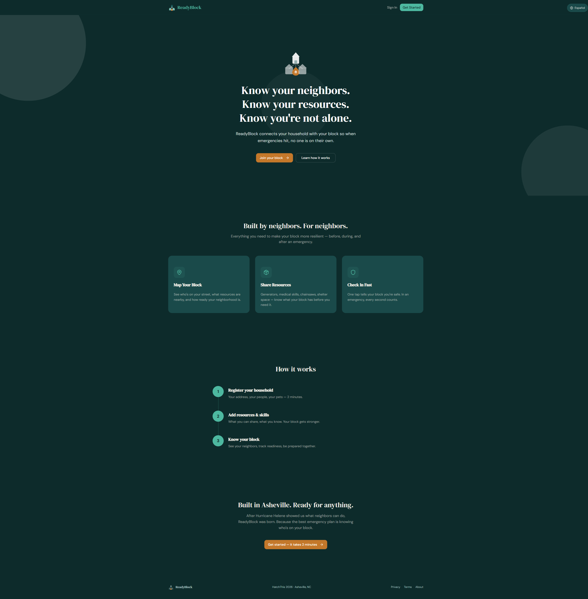
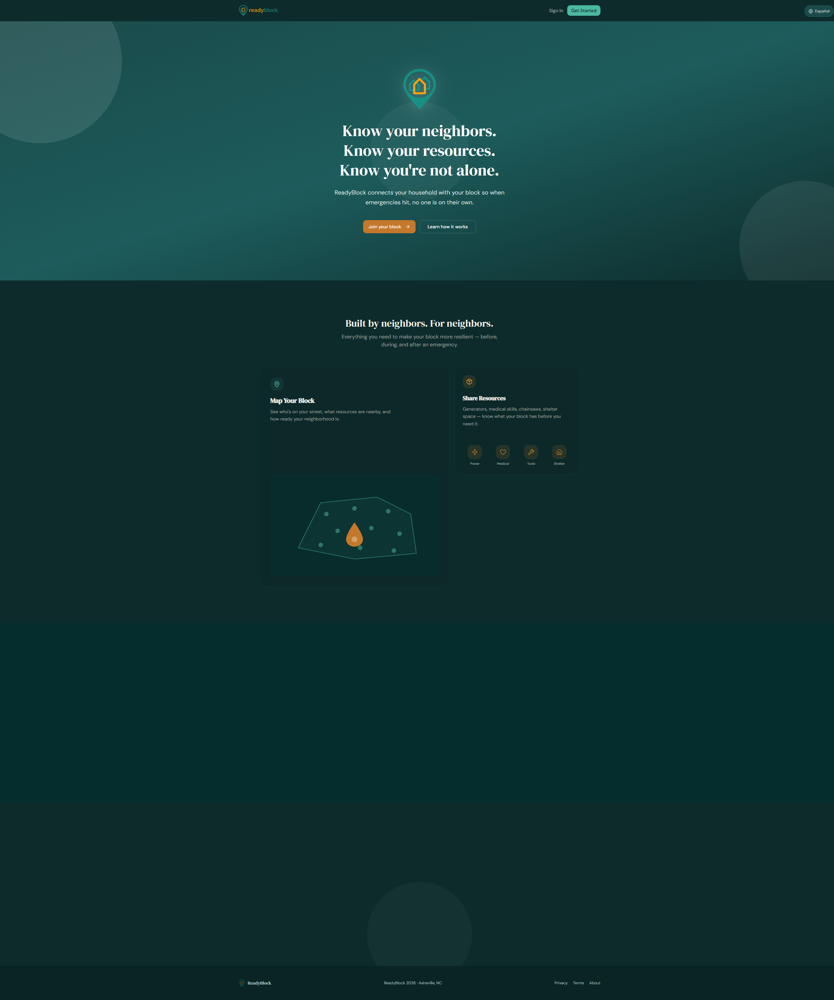
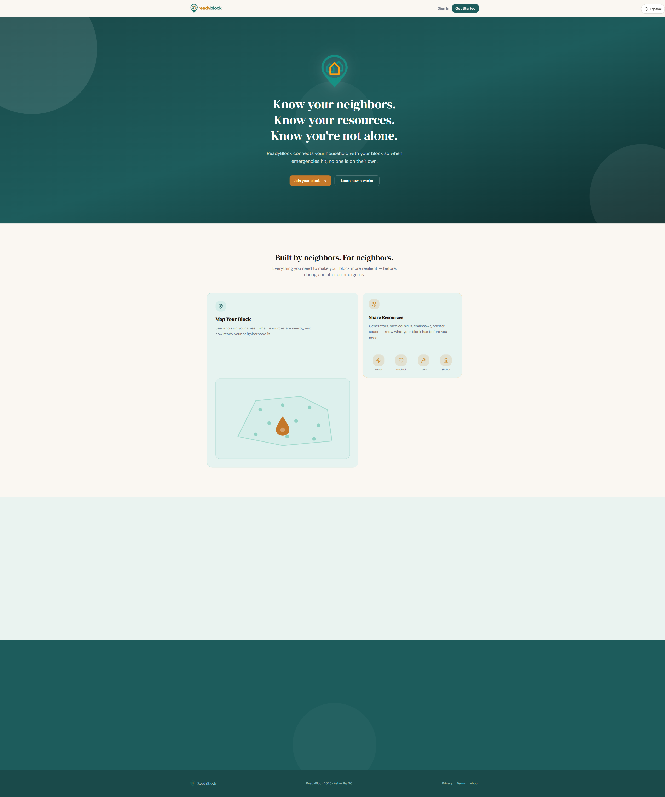
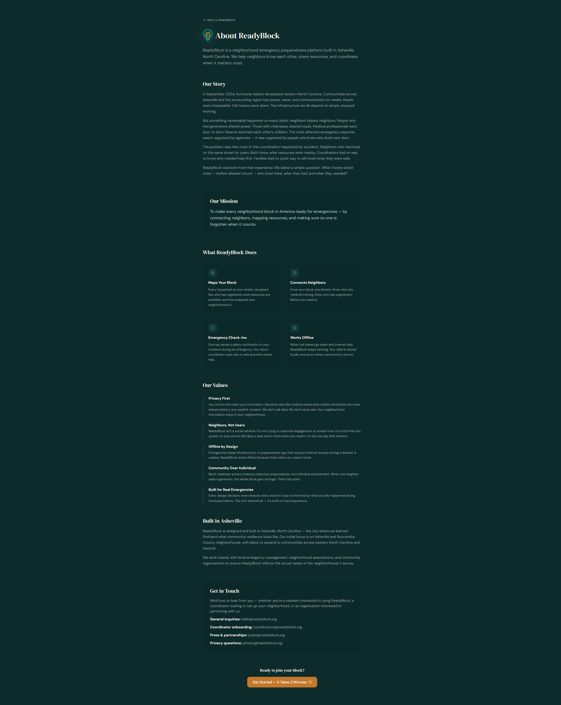

<div align="center">


<br />

### Know your neighbors. Know your resources. Know you're not alone.

<br />


<br />

*Built in 24 hours after Hurricane Helene knocked out Asheville for two weeks.*
*We kept building because the problem was real.*

<br />

[**Live Demo**](https://readyblock-hatch.web.app) &nbsp;&middot;&nbsp; [**Pitch Deck**](https://readyblock-hatch.web.app/pitch/)

</div>

---

<table>
  <tr>
    <td align="center">
      
      <br />
      <sub><b>Landing &mdash; Storm Theme</b></sub>
    </td>
    <td align="center">
      
      <br />
      <sub><b>Resident Dashboard</b></sub>
    </td>
  </tr>
  <tr>
    <td align="center">
      
      <br />
      <sub><b>Landing &mdash; Blue Sky Theme</b></sub>
    </td>
    <td align="center">
      
      <br />
      <sub><b>About &mdash; The Helene Story</b></sub>
    </td>
  </tr>
</table>

## Features

ReadyBlock gives neighborhoods the tools to organize before disaster strikes &mdash; and stay connected when infrastructure fails.

<table>
  <tr>
    <td width="50%">
      <h4>Offline-First Architecture</h4>
      Cached on-device via IndexedDB. Works without power, cell, or internet.
    </td>
    <td width="50%">
      <h4>One-Tap Safety Check-In</h4>
      "I'm Okay" sends SMS and email to emergency contacts. Queues offline, sends on reconnect.
    </td>
  </tr>
  <tr>
    <td>
      <h4>Interactive Block Map</h4>
      Leaflet-powered neighborhood map with household and rally point layers.
    </td>
    <td>
      <h4>Resource &amp; Skills Registry</h4>
      Generators, medical training, tools, shelter space &mdash; searchable across your block.
    </td>
  </tr>
  <tr>
    <td>
      <h4>Role-Based Access</h4>
      Residents, Block Captains, and City Admins each see exactly what they need.
    </td>
    <td>
      <h4>Bilingual (EN / ES)</h4>
      Full English and Spanish localization with 460+ i18n keys.
    </td>
  </tr>
</table>

## Tech Stack


| Layer | Technology | Why |
|-------|-----------|-----|
| **Frontend** | React 19, Vite 6 | Latest React with instant HMR and optimized builds |
| **Styling** | Tailwind CSS v4, shadcn/ui | Utility-first CSS with accessible, composable components |
| **State** | Zustand, TanStack Query | Lightweight global state + smart server-state cache |
| **Maps** | Leaflet | Open-source, offline-capable, no API key required |
| **Auth** | Firebase Auth | Email/password with custom role claims |
| **Database** | Firestore + Dexie.js | Cloud sync paired with local IndexedDB for offline reads |
| **Backend** | Cloud Functions (Node.js) | Serverless event handlers that auto-scale to zero |
| **PWA** | Workbox + vite-plugin-pwa | Precaching, runtime caching, and background sync |
| **i18n** | react-i18next | Runtime language switching across 2 locales |
| **Hosting** | Firebase Hosting | CDN-backed with zero-config SSL |

## Offline-First Architecture

When disasters hit, infrastructure fails first. ReadyBlock is designed to work without it.

**Pre-cache on install** &mdash; Workbox precaches all app assets (JS, CSS, HTML, icons) via the service worker. The app loads instantly from cache, even with no network.

**Local-first data** &mdash; Household profiles, resources, skills, and neighborhood data are mirrored to IndexedDB via Dexie.js. Reads always hit local storage first. Firestore is the sync target, not the source of truth during an emergency.

**Offline queue** &mdash; Actions taken offline (check-ins, profile updates, resource changes) are queued in IndexedDB. When connectivity returns, the queue replays automatically with conflict resolution.

```
[User Action] ──> [Dexie (IndexedDB)] ──> [Offline Queue] ──> [Firestore]
                         ^                                         |
                         └──────── sync on reconnect ──────────────┘
```

## Project Structure

```
src/
├── pages/                    # 29 route components
│   ├── admin/                # City-level oversight (5)
│   ├── auth/                 # Registration & verification (7)
│   ├── coordinator/          # Block captain tools (6)
│   ├── legal/                # About, privacy, terms (3)
│   └── resident/             # Household features (8)
├── components/
│   ├── layout/               # AppShell, nav, role gates
│   ├── map/                  # Leaflet map layers
│   └── ui/                   # 20+ shadcn/ui primitives
├── services/                 # Firebase, sync, encryption (10)
├── stores/                   # Zustand global state (5 stores)
├── hooks/                    # Online status, theme, roles
├── i18n/                     # en.json, es.json (460+ keys)
└── styles/                   # Design tokens, theme system
```

## Getting Started

**Prerequisites:** Node.js 22+ and a Firebase project

```bash
# 1. Clone
git clone https://github.com/SirPsycho828/ReadyBlock.git
cd readyblock

# 2. Install
npm install

# 3. Configure environment
cp .env.example .env.local
# Add your Firebase config keys to .env.local

# 4. Start dev server
npm run dev
```

Open `http://localhost:5173` &mdash; the app runs offline-capable even in dev.
