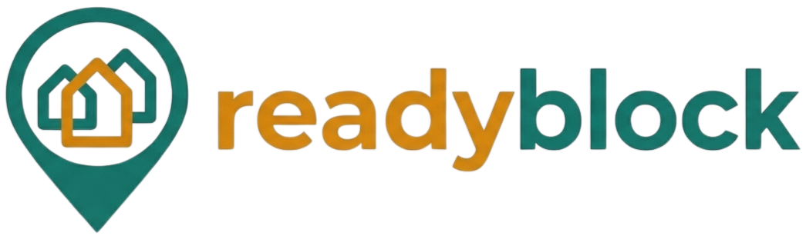
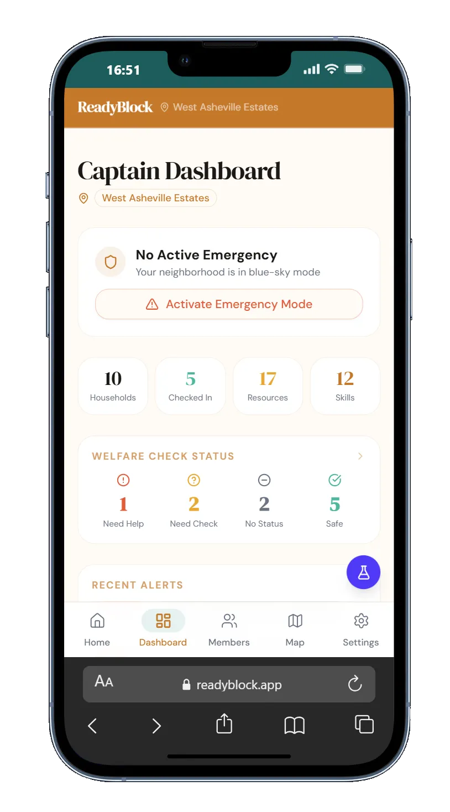
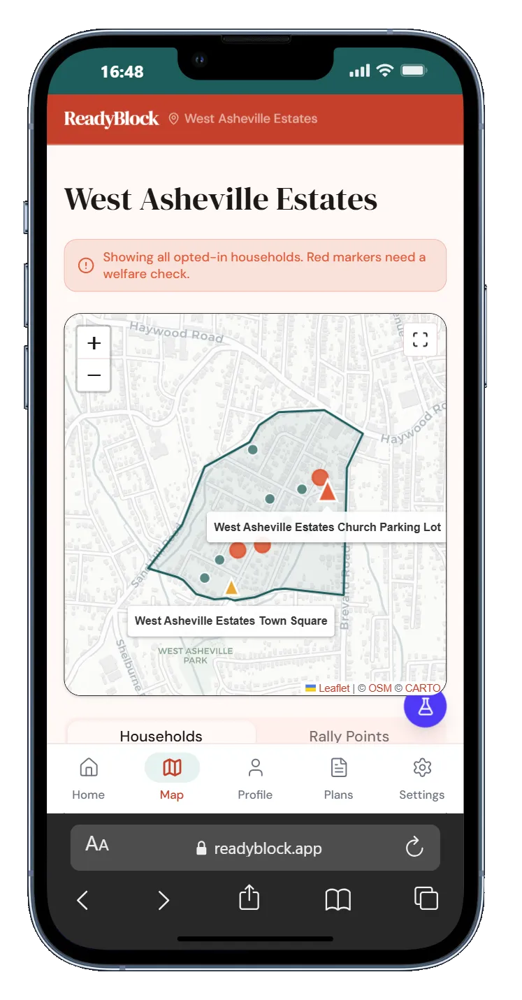
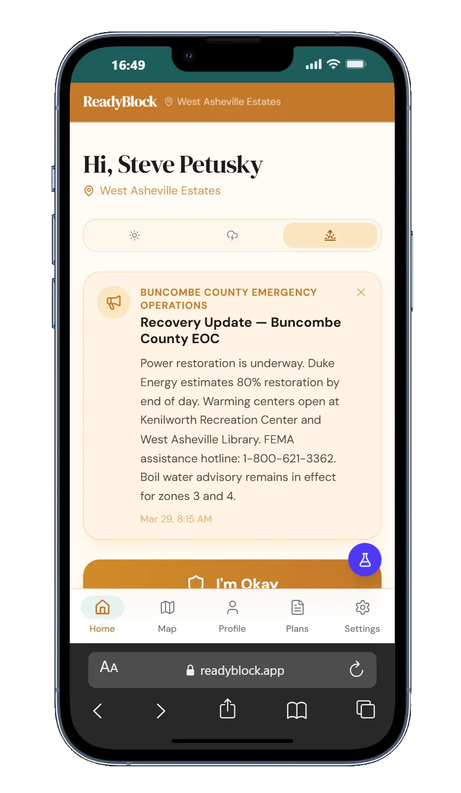
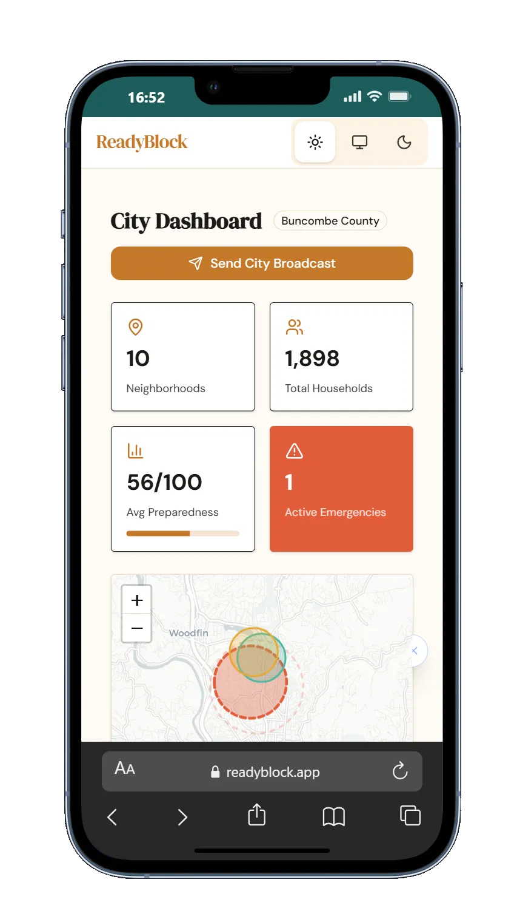
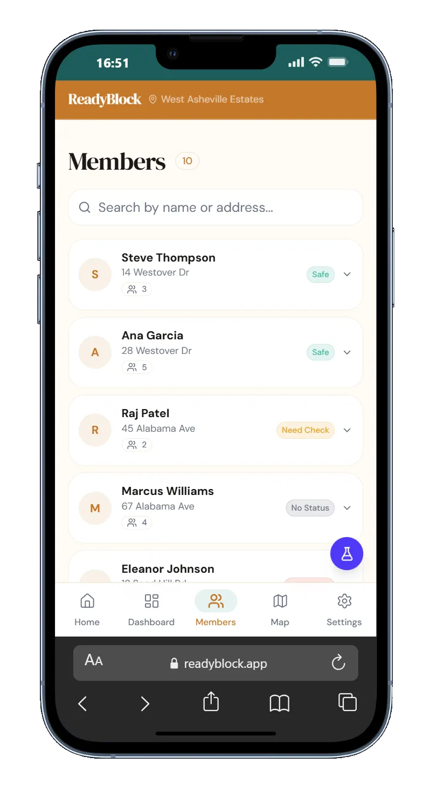
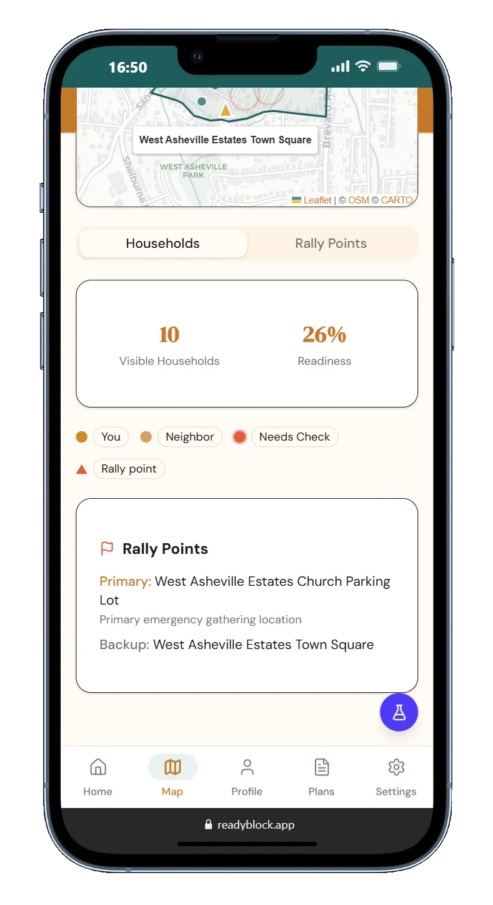
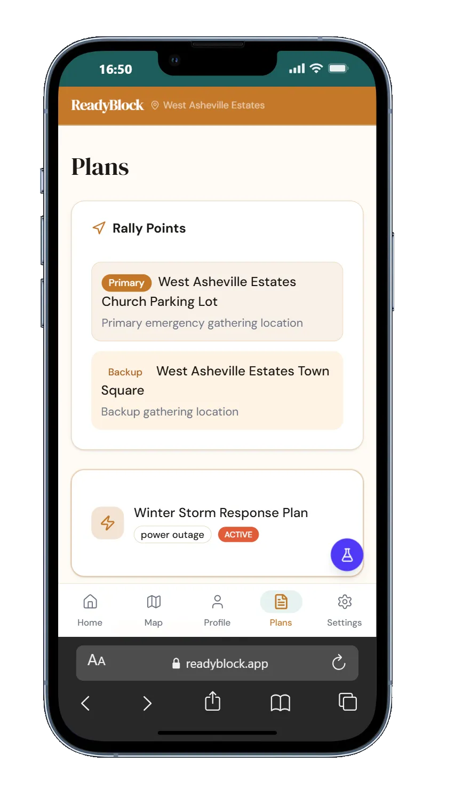
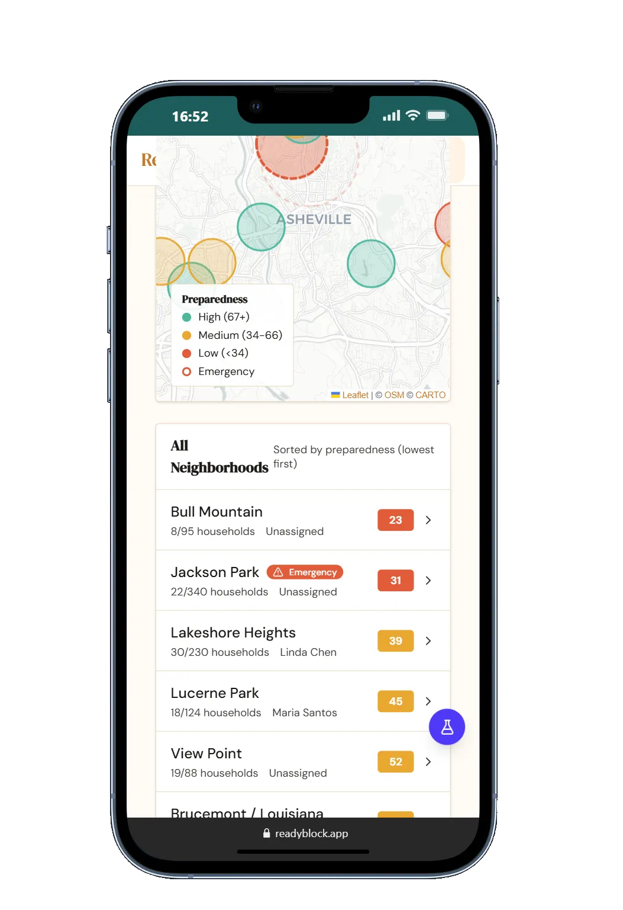

<div align="center">



<br />

### Know your neighbors. Know your resources. Know you're not alone.

<br />


<br />

[**Live Demo**](https://readyblock-hatch.web.app) &nbsp;&middot;&nbsp; [**Pitch Deck**](https://readyblock-hatch.web.app/pitch/)

</div>

---

## The Problem

In September 2024, Hurricane Helene knocked out power, water, and cell service across Asheville, NC for **two weeks**. Neighbors couldn't check on each other. Captains couldn't coordinate. The city couldn't see which blocks needed help. ReadyBlock was built in 24 hours to solve that problem &mdash; and we kept building because the problem was real.

---

<table>
  <tr>
    <td align="center">
      
      <br />
      <sub><b>Captain Dashboard</b></sub>
    </td>
    <td align="center">
      
      <br />
      <sub><b>Storm Mode &mdash; Map</b></sub>
    </td>
    <td align="center">
      
      <br />
      <sub><b>Recovery &mdash; Check-In</b></sub>
    </td>
    <td align="center">
      
      <br />
      <sub><b>City Admin Dashboard</b></sub>
    </td>
  </tr>
  <tr>
    <td align="center">
      
      <br />
      <sub><b>Members &mdash; Welfare Status</b></sub>
    </td>
    <td align="center">
      
      <br />
      <sub><b>Map &mdash; Rally Points</b></sub>
    </td>
    <td align="center">
      
      <br />
      <sub><b>Plans &amp; Protocols</b></sub>
    </td>
    <td align="center">
      
      <br />
      <sub><b>City &mdash; Neighborhoods</b></sub>
    </td>
  </tr>
</table>

## Features

<table>
  <tr>
    <td width="50%">
      <h4>Offline-First Architecture</h4>
      Cached on-device via IndexedDB + Workbox service worker. Works without power, cell, or internet &mdash; exactly when you need it most.
    </td>
    <td width="50%">
      <h4>One-Tap Safety Check-In</h4>
      "I'm Okay" queues SMS and email to emergency contacts even offline. Sends automatically on reconnect via background sync.
    </td>
  </tr>
  <tr>
    <td>
      <h4>Interactive Block Map</h4>
      Leaflet-powered neighborhood map with household markers, rally point layers, and polygon boundaries. No Google Maps API key required.
    </td>
    <td>
      <h4>Resource &amp; Skills Registry</h4>
      Generators, medical training, tools, shelter space &mdash; searchable across your block. Know who has what before disaster strikes.
    </td>
  </tr>
  <tr>
    <td>
      <h4>Three App Modes</h4>
      <b>Blue Sky</b> (prepare), <b>Storm</b> (respond), and <b>Recovery</b> (rebuild) &mdash; each mode transforms the UI, data priority, and available actions.
    </td>
    <td>
      <h4>Bilingual (EN / ES)</h4>
      Full English and Spanish localization with 460+ i18n keys. Runtime language switching &mdash; no page reload.
    </td>
  </tr>
</table>

## Three Roles, Three Experiences

ReadyBlock isn't one app &mdash; it's three, sharing a single codebase with role-scoped data access enforced at every layer.

| | Resident | Block Captain | City Admin |
|---|---|---|---|
| **View** | Own household, neighborhood map | All households in block | All neighborhoods city-wide |
| **Actions** | Check in, add resources/skills, update profile | Activate emergency mode, send alerts, manage rally points, run drills | Send city broadcasts, assign captains, view audit logs |
| **Data** | Own contacts, members, sensitive info | Aggregated welfare status, readiness scores | Preparedness scores, emergency counts, household coverage |
| **Nav** | Home, Map, Profile, Plans, Settings | Dashboard, Members, Map, Settings | City Dashboard, Neighborhoods, Map |

## Tech Stack

| Layer | Technology | Why |
|-------|-----------|-----|
| **Frontend** | React 19, Vite 6 | Latest React with instant HMR and optimized builds |
| **Styling** | Tailwind CSS v4, shadcn/ui | Utility-first CSS with accessible, composable components |
| **State** | Zustand, TanStack Query | Lightweight global state + smart server-state cache |
| **Maps** | Leaflet, OpenStreetMap | Open-source, offline-capable, no API key required |
| **Auth** | Firebase Auth | Email/password + email link with role-based custom claims |
| **Database** | Firestore + Dexie.js | Cloud sync paired with local IndexedDB for offline reads |
| **Backend** | Cloud Functions v2 (Node.js) | Serverless triggers + callable functions, auto-scale to zero |
| **SMS/Email** | Twilio | "I'm Okay" safety notifications to emergency contacts |
| **Geocoding** | Google Maps Geocoding API | Address-to-coordinate + automatic neighborhood assignment |
| **PWA** | Workbox + vite-plugin-pwa | Precaching, runtime caching, and background sync |
| **i18n** | react-i18next | Runtime language switching across 2 locales |
| **Hosting** | Firebase Hosting | CDN-backed with zero-config SSL |

## Architecture

### Offline-First Data Flow

When disasters hit, infrastructure fails first. ReadyBlock is designed to work without it.

```
[User Action] ──> [Dexie (IndexedDB)] ──> [Offline Queue] ──> [Firestore]
                         ^                                         |
                         └──────── sync on reconnect ──────────────┘
```

- **Pre-cache on install** &mdash; Workbox precaches all app assets via the service worker. The app loads from cache with zero network.
- **Local-first reads** &mdash; Household profiles, resources, skills, and neighborhood data are mirrored to IndexedDB. Firestore is the sync target, not the source of truth during an emergency.
- **Offline queue** &mdash; Check-ins, profile updates, and resource changes queue in IndexedDB. On reconnect, the queue replays automatically.

### Cloud Functions

Six serverless functions handle operations too sensitive for client-side execution:

| Function | Trigger | What it does |
|----------|---------|-------------|
| `onUserCreate` | Firestore `users/{uid}` create | Sets default role, initializes profile |
| `onHouseholdCreate` | Firestore `households/{id}` create | Geocodes address, assigns neighborhood via point-in-polygon |
| `sendImAliveMessage` | HTTPS callable | Sends "I'm Okay" SMS/email to emergency contacts via Twilio |
| `seedNeighborhoods` | HTTPS callable | Batch-seeds GeoJSON neighborhood boundaries (admin only) |
| `geocodeAndAssign` | HTTPS callable | Manual geocoding + neighborhood reassignment |
| `notifyNewsletter` | HTTPS callable | Sends neighborhood-scoped email broadcasts |

### Security Model

Security is enforced at **three layers** &mdash; not just the frontend.

**Firestore Security Rules (292 lines)** &mdash; Every read and write is scoped by role and neighborhood:
- Residents can only read/write their own household data
- Captains see all households **in their block only**
- City admins see all neighborhoods **in their city only**
- Server-managed fields (`role`, `neighborhoodId`, `lat`, `lng`, `assignmentStatus`) are **never client-writable**
- Sensitive subcollections (medical needs, contacts) have separate access rules
- Audit logs are write-only via Cloud Functions, read-only by city admins

**Cloud Functions** &mdash; Role assignment, geocoding, and SMS delivery run server-side. Clients never touch API keys.

**Client-side** &mdash; Route guards, role-aware components, and Zustand stores enforce UI-level access. But security never depends on the client alone.

### Data Model

```
Firestore
├── users/{uid}                    # Profile, role, neighborhood assignment
├── households/{uid}               # Address, coordinates, readiness, check-in status
│   ├── /sensitive/{doc}           # Medical needs, accessibility, special conditions
│   ├── /contacts/{contactId}      # Emergency contacts (name, phone, relationship)
│   └── /members/{memberId}        # Household members (age, needs)
├── neighborhoods/{id}             # Name, city, boundary polygon, rally points
│   └── /members/{uid}             # Membership roster (Cloud Functions only)
├── resources/{id}                 # Generators, tools, shelter — scoped to neighborhood
├── skills/{id}                    # CPR, ham radio, medical — scoped to neighborhood
├── alerts/{id}                    # Captain-issued neighborhood alerts
├── drills/{id}                    # Preparedness drills with per-household status
│   └── /statuses/{householdId}    # Individual drill responses
├── protocols/{id}                 # Emergency action plans and response procedures
├── coordinatorNotes/{id}          # Captain-only internal notes (never visible to residents)
├── auditLogs/{id}                 # Immutable system event log (Cloud Functions only)
├── verificationRequests/{id}      # Address verification workflow
├── coordinatorAgreements/{id}     # Captain onboarding agreements
└── inviteCodes/{code}             # Neighborhood invite codes (server-only, never client-readable)
```

## Project Structure

```
readyblock/
├── src/
│   ├── pages/                     # Route components (29 pages)
│   │   ├── admin/                 #   City-level oversight (5)
│   │   ├── auth/                  #   Registration, verification, landing (7)
│   │   ├── coordinator/           #   Block captain tools (6)
│   │   ├── legal/                 #   About, privacy, terms (3)
│   │   └── resident/              #   Household features (8)
│   ├── components/
│   │   ├── layout/                #   AppShell, nav, role gates
│   │   ├── map/                   #   Leaflet map layers (neighborhood + city)
│   │   └── ui/                    #   20+ shadcn/ui primitives
│   ├── services/                  #   Firebase, sync, encryption, offline queue (10)
│   ├── stores/                    #   Zustand global state (5 stores)
│   ├── hooks/                     #   Online status, theme, effective role
│   ├── i18n/                      #   en.json, es.json (460+ keys each)
│   └── lib/                       #   Utilities, mock data, Firebase config
├── functions/                     #   Cloud Functions v2 (Node.js)
├── firestore.rules                #   292-line role-based security rules
├── firestore.indexes.json         #   Composite query indexes
├── public/
│   ├── images/                    #   App icons, logos, favicons
│   └── pitch/                     #   Investor pitch deck (36 slides)
└── scripts/                       #   Seed data, neighborhood import tools
```

**~10,500 lines of code** across **95 source files**

## Getting Started

**Prerequisites:** Node.js 22+ and a Firebase project

```bash
# 1. Clone
git clone https://github.com/SirPsycho828/ReadyBlock.git
cd ReadyBlock

# 2. Install
npm install

# 3. Configure environment
cp .env.example .env.local
# Add your Firebase config keys to .env.local

# 4. Start dev server
npm run dev
```

Open `http://localhost:5173` &mdash; the app runs offline-capable even in dev.

### Environment Variables

```bash
# Required — Firebase client SDK
VITE_FIREBASE_API_KEY=
VITE_FIREBASE_AUTH_DOMAIN=
VITE_FIREBASE_PROJECT_ID=
VITE_FIREBASE_STORAGE_BUCKET=
VITE_FIREBASE_MESSAGING_SENDER_ID=
VITE_FIREBASE_APP_ID=

# Optional — demo/admin features
VITE_ADMIN_EMAIL=              # Email that sees the demo role switcher

# Server-side only (Cloud Functions .env)
# GOOGLE_MAPS_API_KEY=         # Geocoding API
# TWILIO_ACCOUNT_SID=          # SMS notifications
# TWILIO_AUTH_TOKEN=            # SMS notifications
# TWILIO_PHONE_NUMBER=         # SMS sender number
```

## Related

- [ReadyBlock Flutter App](https://github.com/SirPsycho828/ReadyBlock-Flutter) &mdash; Companion mobile app (Flutter/Dart) with full feature parity
- [Video Walkthrough](https://www.youtube.com/shorts/cMQAAtAUSHQ) &mdash; YouTube Shorts demo of the app in action

## License

MIT
